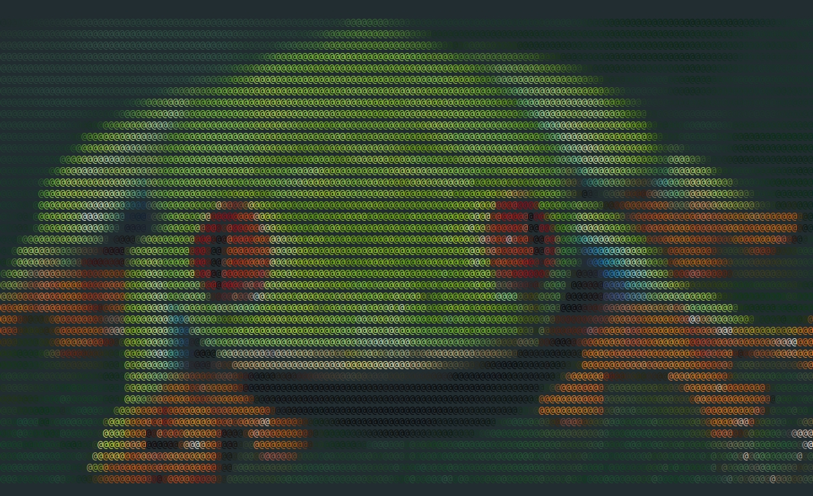
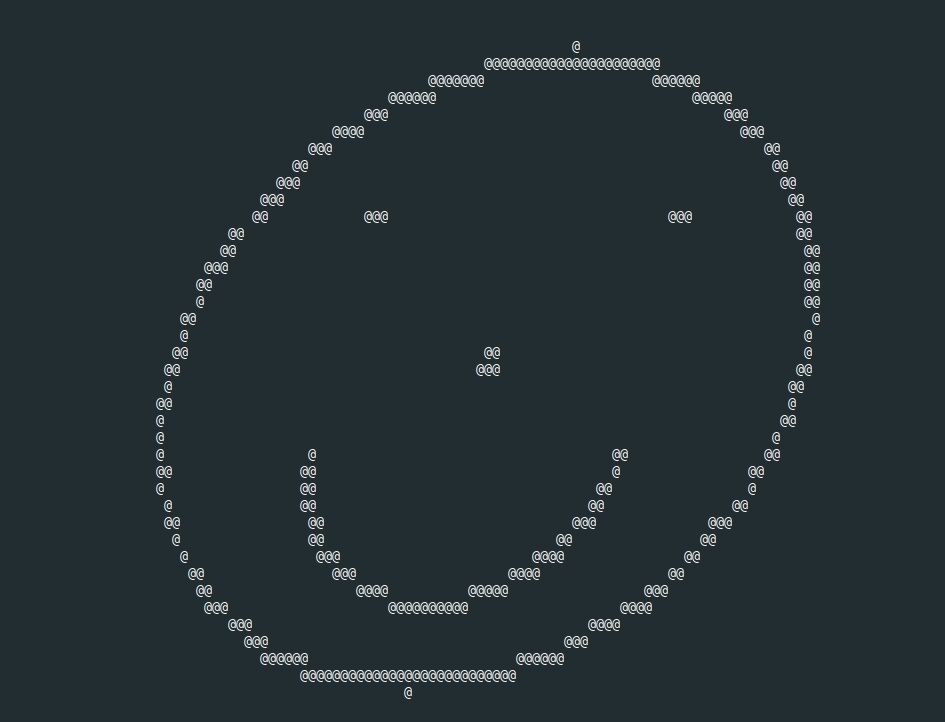

# C Graphics


## Smiley
```make smiley && make smile```

## ASCII IMG Viever compilation & run
```make && make test```

## libimago installation
- clone repository: `git clone https://github.com/jtsiomb/libimago.git`
- build: `cd libimago && make`
- install: `sudo make install && sudo ldconfig`

## ToDo
- [ ] proper image scaling
- [ ] better memory allocation for vectors


